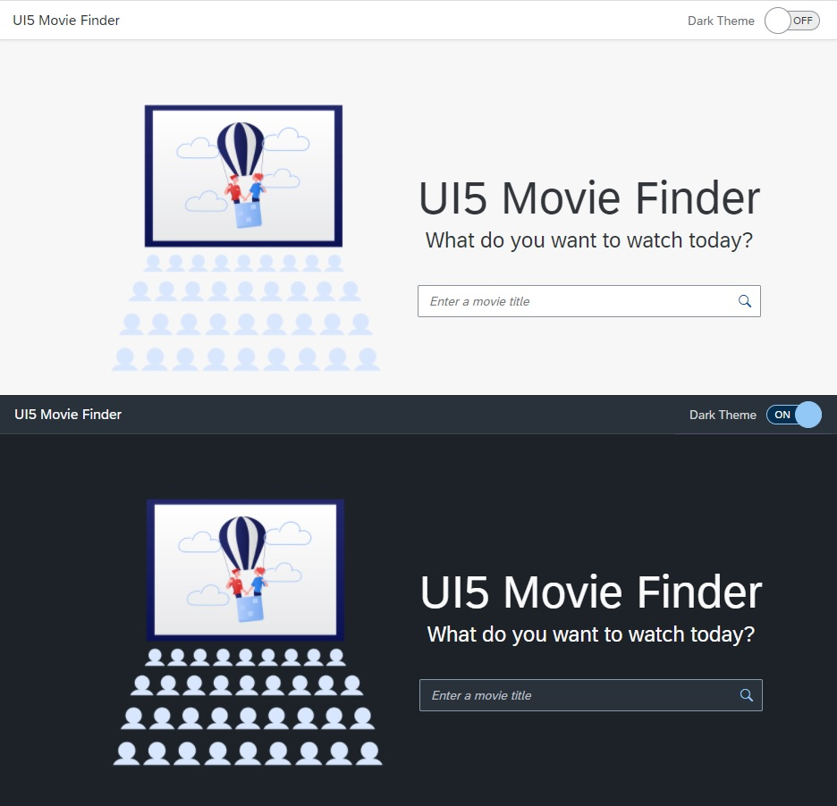

# UI5 Movie Finder

### [Live Demo](https://jansenpenido-ui5-movie-finder.herokuapp.com)

## Overview
This [OpenUI5](https://openui5.org) application lets you search for movies using [The Open Movie Database API](http://www.omdbapi.com).



This project explores the following concepts:

- **API Security**: Consumption of RESTful API using a custom proxy server for authentication.
- **Light/Dark mode**: User theme customization.
- **CSS Grids**: Display of search results as cards.

## Instructions

In order to run this application locally, please sign up to the [The Open Movie Database API](http://www.omdbapi.com), create a file ".env" inside the webapp folder and add your API key in the following format:

```
OMDB_API_KEY = [Your API key]
```

## Acknowledgements

- Illustrations designed by [Icons 8](https://icons8.com.br/).
